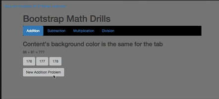

# bootstrapMathDrills
Learning bootstrap and jQuery

## Challenge
1. Have the four tabs work
  1. Only fill the Addition tab with content
1. Generate a random addition problem with whole numbers between 0 and 100.
1. Offer three possible answers as buttons
1. When the user clicks on an answer button, display "Try again" or "Correct"
1. When the user clicks "New Addition Problem", make a new problem


## Notes about Matt's Quick solution
1. Line counts (made by the `wc` command line utility)
```
  97 index.html
   7 styles.css
 104 total
```
1. 45 lines of javascript in four functions.  I did not write shuffle, I got it from here: http://stackoverflow.com/questions/2450954/how-to-randomize-shuffle-a-javascript-array   Shuffle is 16 lines long.  The functions I did write are:
   1. newAddProblem -- Generates random numbers and displays 
   1. grade -- compares the answer with the number on the button and changes the text on the addFeedback paragraph
   1. assign -- Displays the value on a button and connects grade to the click


## Future Stuff
1. We'll keep score!
1. We'll use local storage to persist the score
1. We'll use github pages to serve the app
1. We'll see if it looks good on cell phones



